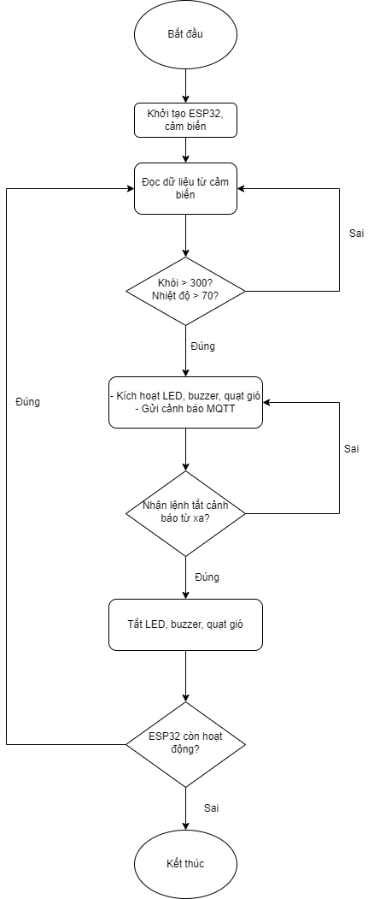
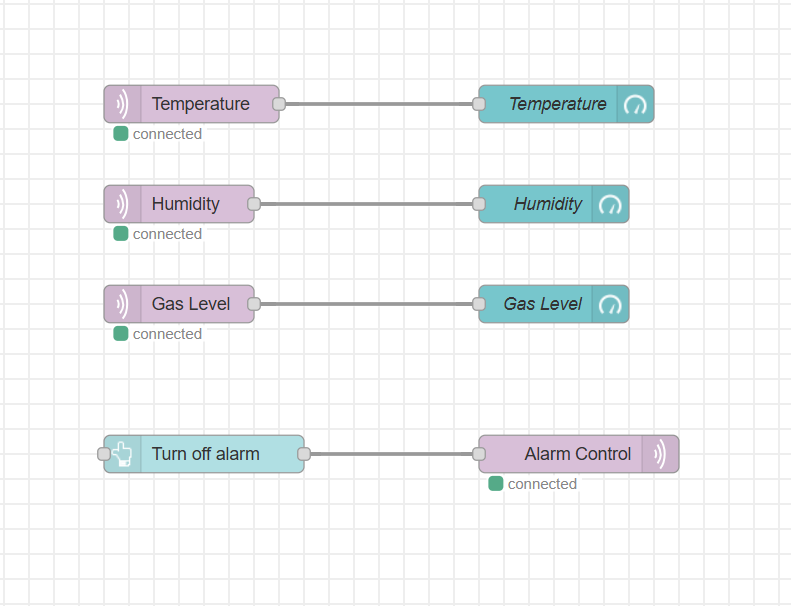
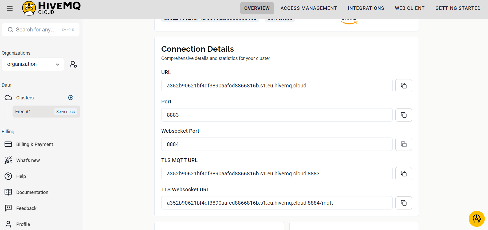

# Đề tài giữa kỳ Phát triển ứng dụng IoT: Hệ thống báo cháy thông minh

## Ý tưởng
Các vụ cháy xảy ra ngày càng nhiều trong thời gian qua. Nguyên nhân chủ yếu là do sự thiếu cảnh giác của người dân và không có cảnh báo rõ ràng khi cháy xảy ra.
Hệ thống báo cháy thông minh được thiết kế giám sát các dữ liệu khói và nhiệt độ trong không gian nhất định (nhà ở, cơ quan, kho hàng,...). Khi phát hiện có cháy, hệ thống sẽ kích hoạt đèn LED, loa cảnh báo và quạt thông gió.

## Phần cứng sử dụng
* ESP32 Devkit v1
* Cảm biến khí gas MQ2
* Cảm biến nhiệt độ, độ ẩm DHT11
* LED
* Buzzer
* Động cơ DC (cho quạt gió)

## Sơ đồ khối

## Flow Node-RED

## Kết nối MQTT
Sử dụng sever MQTT trên cloud của HiveMQ

